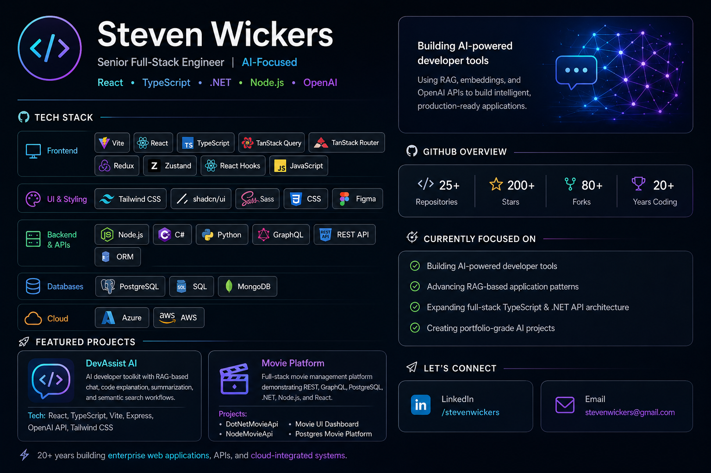

  

# 👋 Steven Wickers

### 🚀 Senior Full-Stack Engineer | AI-Focused

**React • TypeScript • .NET • Node.js • OpenAI**

---

## ⚡ DevAssist AI Focus

Building modern AI-powered developer tools using **RAG, embeddings, and OpenAI APIs** to create intelligent, production-ready applications.

---

## 🧠 Tech Stack

### 🖥️ Frontend

---

### 🎨 UI & Styling

---

### 🔗 Backend & APIs

---

### 🗄️ Databases

---

### ☁️ Cloud

---

## 🧩 Featured Projects

### 🚀 DevAssist AI

AI-powered developer toolkit featuring:

* RAG-based portfolio chat
* Code explanation workflows
* Text summarization
* Semantic search with embeddings

**Tech:** React, TypeScript, Vite, Express, OpenAI API, Tailwind CSS

---

### 🎬 Movie Platform

Full-stack system showcasing enterprise architecture:

* REST + GraphQL APIs
* PostgreSQL with advanced querying
* .NET + Node.js backends
* React frontend dashboard

**Projects:**

* DotNetMovieApi
* NodeMovieApi
* Movie UI Dashboard
* PostgreSQL Movie Platform

---

## 🧠 Core Expertise

* **AI Development:** RAG, OpenAI APIs, embeddings, semantic search
* **Frontend Engineering:** Scalable React architecture, state management, UI systems
* **Backend Systems:** .NET & Node.js APIs, Dapper, database design
* **Data Layer:** PostgreSQL functions, performance tuning, query design
* **Architecture:** Full-stack systems, API design, developer tooling

---

## 🎯 Current Focus

* Building AI-first developer tools
* Advancing RAG application patterns
* Designing scalable full-stack architectures
* Creating portfolio-grade AI projects

---
## 📬 Contact

* 💼 LinkedIn: https://www.linkedin.com/in/stevenwickers/
* ▶️ YouTube: https://www.youtube.com/@stevenwickers-developer
* 🌐 Portfolio: https://stevenwickers.com/
* 📧 Email: [stevenwickers@gmail.com](mailto:stevenwickers@gmail.com)

## 📊 GitHub Stats

  
  

